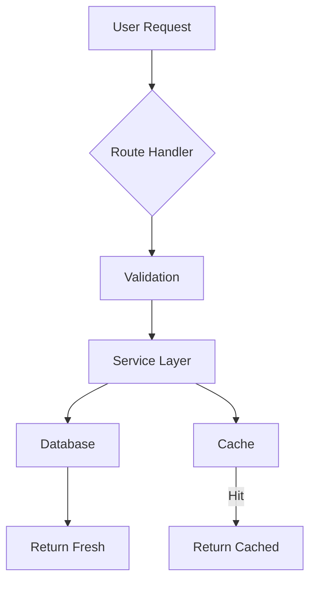

# V3Code Canvas Skill

## What is Canvas?

Canvas is a mechanism for the agent to produce rich, interactive visual outputs alongside the chat — rather than dumping everything into markdown text. Use canvas when the output benefits from visual layout.

## When to Use Canvas

**Use canvas for:**
- Data tables (better than markdown tables)
- Architecture diagrams (Mermaid)
- Comparison charts
- Interactive explorations (expandable sections)
- Dashboard-style summaries
- Timeline/progress visualizations
- Code flow diagrams
- Cost breakdowns and billing summaries

**Don't use canvas for:**
- Simple text answers
- Single code blocks
- Short lists (< 5 items)
- File contents

## Mermaid Diagrams

When the user asks about architecture, relationships, or flow:



## Data Presentation

Instead of:
```
| Name | Size | Type |
|------|------|------|
| app.ts | 2.4KB | TypeScript |
```

Produce a structured, sortable, filterable table with proper alignment.

## Interactive Patterns

### Expandable Sections
For large outputs, use collapsible sections:
- Summary visible by default
- Details expandable on click
- Code blocks with syntax highlighting

### Progress/Timeline
For multi-step processes:
- Step indicators (complete/in-progress/pending)
- Duration for each step
- Links to relevant files

## Best Practices

1. **Always include a text summary** — canvas enhances, doesn't replace text
2. **Keep it focused** — one visualization per canvas
3. **Label everything** — axes, legends, column headers
4. **Responsive** — should work at different panel widths
5. **Accessible** — include alt text and data tables for charts
